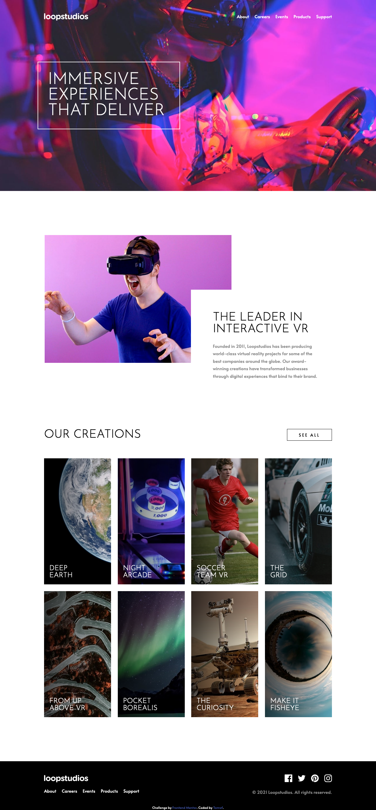
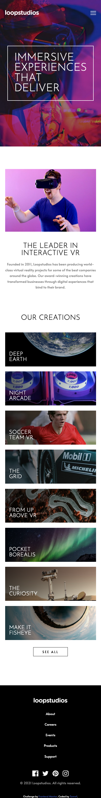

# Frontend Mentor - Loopstudios landing page solution

This is a solution to the [Loopstudios landing page challenge on Frontend Mentor](https://www.frontendmentor.io/challenges/loopstudios-landing-page-N88J5Onjw). Frontend Mentor challenges help you improve your coding skills by building realistic projects. 

## Table of contents

- [Overview](#overview)
  - [The challenge](#the-challenge)
  - [Screenshot](#screenshot)
  - [Links](#links)
- [My process](#my-process)
  - [Built with](#built-with)
  - [What I learned](#what-i-learned)
  - [Useful resources](#useful-resources)

## Overview

### The challenge

Users should be able to:

- View the optimal layout for the site depending on their device's screen size
- See hover states for all interactive elements on the page

### Screenshot

#### Desktop Version


#### Mobile Version


### Links

- Live Site URL: [Loopstudios landing page](https://your-live-site-url.com)

## My process

### Built with

- Semantic HTML5 markup
- CSS custom properties
- Flexbox
- CSS Grid
- Mobile-first workflow
- Sass
- jQuery

### What I learned

I learned to do an animated underline:
```scss
a {
  display: inline-block;
  position: relative;
  transition: .2s;

  &.underline {
    padding-bottom: .5em;
  }

  &.underline::after {
    content: '';
    border-bottom: 3px solid $white;
    border-radius: 2em;
    position: absolute;
    bottom: 0;
    left: 50%;
    width: 0;
    transform: translateX(-50%);
    transition: .2s;
  }

  &.underline:hover::after {
    width: 50%;
  }
}
```

### Useful resources

- [CSS Animated Underline Links](https://www.cssportal.com/blog/css-animated-underline-links/) - This helped me build css animated underline links.
- [A Complete Guide to Flexbox](https://css-tricks.com/snippets/css/a-guide-to-flexbox/) - This is an amazing guide to flexbox.
